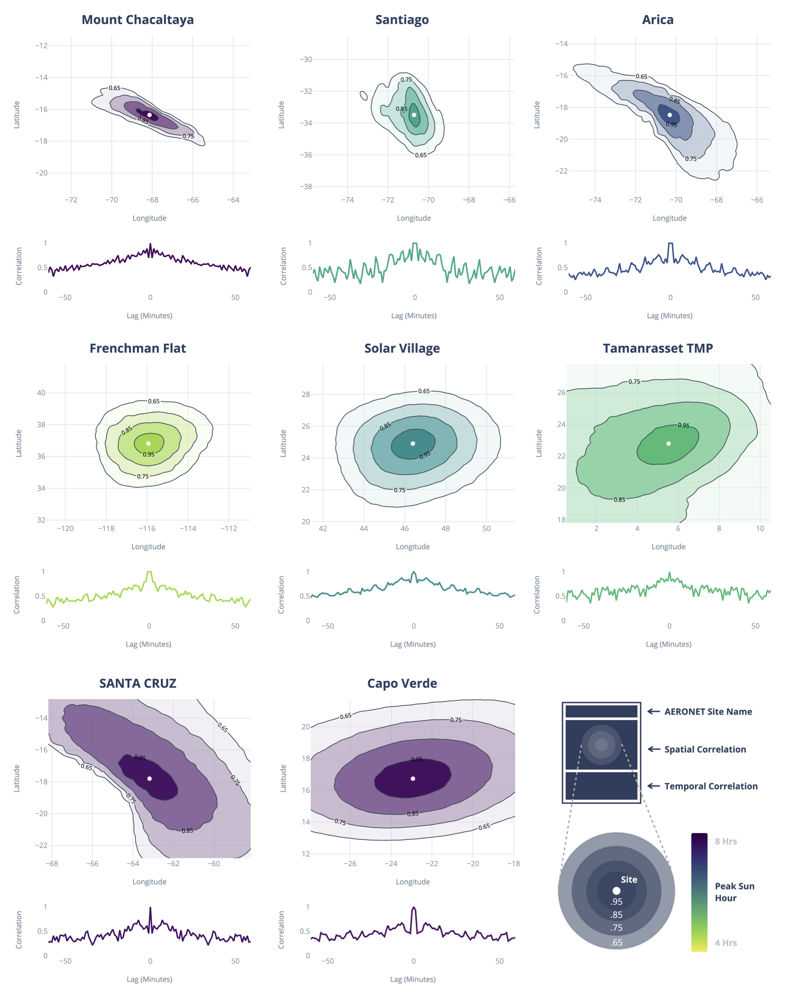
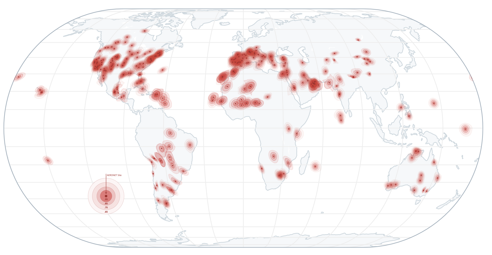

# 🗺️ Spatiotemporal Representativeness of AERONET Sites

This is a collection of simple tools and results for quantitatively investigating the spatial and temporal representativeness of select AERONET sites. 

### 🙏 Just Give Me the Results
The main results are pre-computed and saved as convinient `.json` files. You can find these under `results/`. These are named after the AERONET site. There are also corresponding plots under `plots/` for each site. If you cannot find the site you are after, see below. For example, for the Tamanrasset TMP site, simply do:

```
import json
results = json.load(open('Tamanrasset_TMP.json'))
```
`results` is a dictionary with the following keys:

- `site_name` is the name of the site.
- `site_lon` and `site_lat` are the coordinates of the AERONET site.
- `num_of_matched_months` is the number of months of data that went into the correlation calculations. If this is less than 12, be careful about seasonal effects, as not the entire year has been taken into account. 
- `contours` are the spatial bounds by correlation thresholds. This is a dictionary where the correlation thresholds (e.g. '0.99') are the keys. Accessing each key will give you another dictionary with `lon`, `lat` and `area` of the enclosing contour. The area is in m<sup>2</sup>. See the example section below. 
- `spatial_corr` is a list of list (n by n) containing the spatial Pearson's correlations
- `longitudes` (n by 1) and `latitudes` (n by 1) are lists of coordinates corresponding to the `spatial_corr`. 
- `p_vals` is a list of list (n by n), corresponding to `spatial_corr`. 
- `temporal_corr` is a dictionary of two lists. `lags` are the minutes in lags, and `corr` are the temporal correlation corrsponding to those lags. Both lists are of the same length. 

You can find plots of `spatial_corr`, `contours` and `temporal_corr` under `plots/`. 

### 🐍 Examples in Python

You can ask for the area enclosed by the 0.99 correlation bound of the site Tamanrasset TMP:

```
results['contours']['0.99']['area']
>> 10535.626901590156
```

If you want to get the [shapely](https://shapely.readthedocs.io/en/stable/manual.html) geometry of the 0.99 correlation bound of the site Tamanrasset TMP:

```
from shapely import geometry

lon = results['contours']['0.99']['lon'] # note 0.99 is a str
lat = results['contours']['0.99']['lat']

polygon = geometry.Polygon(map(list, zip(*[lon, lat])))
```

Then you can easily query whether any given longitude and latitude pair is within the bound or not. This is useful if you want to use these bounds to do dynamic co-location of satellite observations. 

```
polygon.contains(geometry.Point(5.54, 22.773))
>> True

polygon.contains(geometry.Point(33.23, 62.3))
>> False
```

To plot the results using [plotly](https://plotly.com/python/getting-started/), you can pass the results into a visualisation function. These are the same as those under `plots/`

```
from visualisation import visualise_spatiotemporal_correlation_results
import plotly.graph_objects as go

plot = visualise_spatiotemporal_correlation_results(results)
go.Figure(plot).show()
```

### ☀️ Which Sites Have Pre-Computed Results
This work was created part of a larger peice of work on studying solar energy resources. As such, I was primarily interested in sites that are *sufficiently sunny*, defined as having at least 4 peak sun hours in direct normal irradiance (DNI). As of writing, there are 1198 AERONET sites in total, both historical and present. Only about 60% of them are situated within regions that receive at least 4 peak suyn hours. Notably, regions of tropical rainforest (Amazon and Congo basin), most of central and southeast Asia, and high latitude regions have been masked out by this selection criteria. If you want to study these excluded sites, you will have the get the raw data yourself and run the scripts from scratch unfortunately. 

### 🤞 I Want to Reproduce the Results from Raw Data
This repo contains everything you need to reproduce the `.json` files and, in principle, any AERONET site of interest. You will need the following data:

- `data/aeronet/*.dat` AERONET observations, donloaded from https://aeronet.gsfc.nasa.gov/cgi-bin/draw_map_display_aod_v3
- `data/ecmwf/*.nc` ECMWF MACC surface level total aerosol optical depth fields, 5 degrees by 5 degrees surrounding each of the AERONET sites. These are downloaded from https://apps.ecmwf.int/datasets/data/macc-reanalysis/levtype=sfc/ programmatically. See https://confluence.ecmwf.int/pages/viewpage.action?pageId=82870596#AccessMARS-apiclientlibrary for more information. 
- `data/aeronet_metadata.csv` contains some metadata associated with each AERONET site. 

The raw AERONET and ECMWF files are too large to be included in this repository. They can be downloaded at [http://www.sp.ph.ic.ac.uk/~thc313/spatiotemporal/.](http://www.sp.ph.ic.ac.uk/~thc313/spatiotemporal/Spatiotemporal%20Representativeness%20of%20AERONET%20Sites/)

To reproduce the results from one site, simply do:

```
from main import determine_variability_at_site

results = determine_variability_at_site('Tamanrasset_TMP', json_dump_results = True)
```

The `json_dump_results` key allows you to save the results as a `.json` under `results/` optionally. 

### 🤔 Why is This Useful?

To compare ground-based observations against the three aerosol products, they must first be co-located both in space and time due to the different sampling scales, resolutions and frequencies. Inappropriate up-scaling and down-scaling of observations in both space and time can be a source of significant error. This sampling error, also known as representation error ,  may easily amount to 30 to 160 % in instantaneous root mean square error. The standard approach is to match observations using fixed spatial and temporal thresholds centered at the site and at the overpass/re-analysis time, respectively. The thresholds, however, vary amongst the literature. 

In order to improve the number of colocations, a novel site-dependent threshold is proposed. The idea is that sites with aerosol climatologies that are more spatially homogeneous and temporally stable will permit matches over a greater range in space and time. In other words, sites that are more spatially and temporally representative will have more relaxed thresholds. As such, what follows will be an exercise of quantifying the aerosol spatiotemporal representativeness of AERONET sites.

### 🌎 How is Spatial Representativeness Estimated

Considering spatial representativeness, the τ<sub>550</sub> three-hourly time series from ECMWF MACC over the relevant period for each site is examined. Only time steps between the local sunrise and sunset times are considered, as night times are irrelevant for solar energy applications. The cross-correlation is computed between the τ<sub>550</sub> time series over the site and the time series of its surrounding grid-boxes, up to ±5° The idea is that if a site maintains a high degree of cross-correlation with grid boxes far away from the site, such a site can be deemed as having high spatial representativeness. This approach fundamentally hinges on the accuracy of the ECMWF MACC AOD field. For example, it is known that ECMWF MACC does not perfectly parameterise small scale effects and wet-scavenging behaviour. The latter is not likely to be an important issue given the fact that this study is already restricted to sites that are climatologically sunny.



The figure above shows the result of spatial cross-correlation for eight select sites (Mount Chacaltaya, Bolivia (16.350S, 68.132W); Santiago, Chile (33.490S, 70.717W); Arica, Chile (18.472S, 70.313W); Frenchman Flat, Nevada (36.809N,115.935W); Solar Village, Saudia Arabia (24.907N, 46.397E); Tamanrasset, Algeria (22.790N, 5.530E); Santa Cruz de la Sierra, Bolivia (17.802S, 63.178W); Capo Verde (16.733N, 22.935W)). Focusing on the eight maps where each of the eight sites are centred, contour lines for the cross-correlation are shown at 0.95, 0.85, 0.75 and 0.65. For the grid boxes over the sites, the correlation is, by definition, 1.0 (i.e. self-correlation). As one moves further away from the sites, the correlation decreases in general. For some sites, such as Solar Village and Frenchman Flat, both of which are situated over flat desert areas, the reduction in correlation is approximately isotropic. On the other hand, the cross-correlation pattern over Mount Chacaltaya responds to the orography, with spatial correlation extending further along the valley. Similarly, Santa Cruz's pattern reflects the presence of the Andes Mountains to the west, which disrupts aerosol transport. The correlation pattern over Arica is a response to the coastline, which effectively separates marine like aerosols from desert-like aerosols transported from inland.

The eight sites in the figure are sorted by their spatial-representativeness, here defined as the area enclosed by the 0.95 correlation contour. These eight panels have been arranged as such that the top left is the least spatially representative and the bottom right is the most spatially representative. In general, one observes that mountainous sites (Mount Chacaltaya), urban sites (Santiago) and coastal sites (Arica) are less spatially representative. On the other hand, desert sites (Frenchman Flat, Solar Village, Tamanrasset) and island sites (Capo Verde) experience more homogenous aerosol climatology, and are thus more spatially representative. These general conclusions can be verified on the map below, where the spatial correlation bounds for all AERONET sites under consideration are shown. Note that this map is plotted with an equal-area projection (Eckert IV), meaning that the enclosed areas by contours are comparable across sites. However, Eckert IV is a non-conformal projection, meaning that shapes are distorted.



### ⏱️ How is Temporal Representativeness Estimated
For the quantification of temporal representativeness, a similar approach is adopted with the computation of the *auto*-correlation on the AERONET τ<sub>550</sub> time series. Auto-correlation assesses the self-similarity of a time series. Unlike cross-correlation where one considers the correlation of τ<sub>550</sub> against τ<sub>550</sub> at various distances away from the site, here one looks at the correlation of τ<sub>550</sub> against itself at various temporal lags. The auto-correlation is computed from zero-lag to 60-minute-lag, at one-minute resolution for the entire available τ<sub>550</sub> time series for each site. Sampling rates of AERONET τ<sub>550</sub> vary from site to site. While some sites attempt measurements only once every 15 minutes, most sites make measurements approximately every 3 minutes with a measurement sequence that is under a minute each. Therefore, one should only interpret auto-correlation that is at least 3 minutes in lag. 

The results are shown in the bottom panels of figure above for each of the eight sites. At zero-lag, by definition, the auto-correlation is one. As increasingly greater temporal lags are considered, the auto-correlation fluctuates, but generally decreases with increasing lag. Note that positive and negative lags are symmetric by construction.

From these curves, each site's temporal representativeness can be determined by examining the lag at which the auto-correlation first drops below a threshold. For instance, although Mount Chacaltaya is the least spatially representative amongst the eight sites in the figure, its temporal representativeness is one of the highest. Its auto-correlation first drops below 0.5 at a lag of 40 minutes. This indicates that the aerosol conditions over the valleys of Mount Chacaltaya are relatively stable, which is unsurprising given its elevation of over 5 km a.s.l.  On the other hand, Capo Verde, despite being the most spatially representative site amongst the eight, has its time series auto-correlation drop below 0.5 at a 3-minute-lag. This indicates generally higher aerosol temporal variability over the site.

### 🛰️ Representativeness as a Tool for Colocation
Having established the spatial and temporal representativeness of each of the AERONET sites, it can now be exploited for the purpose of observation colocation. Instead of using a fixed area and temporal window for match searching, a set correlation threshold is specified. For spatial matching, any measurements falling within the set correlation contour will be considered a match in space. Similarly, for a given correlation threshold, one may seek the time lag at which the auto-correlation first falls below the said threshold. Any measurement falling within such ± time lag will be considered a match in time. In other words, dynamically varying spatial and temporal bounds are achieved, depending on each site's representativeness.

It has been decided that a 0.95 threshold for the spatial correlation and a 0.6 threshold for the temporal correlation should be used. In general, there are two extremes to consider. If the thresholds are too tight, there will be an insufficient sample size, and the statistics will be weak. On the other hand, if the thresholds are too relaxed, one risks `polluting' the dataset with measurements that are too far away in space and time, thus compromising the statistics as well. 